[//]: # (Styles:)

[//]: # ()

[//]: # (Actual Github Page:)

<h1>BCI - Emotion - Classification </h1>

 <strong>Authors:</strong> Ernesto/吳心潼 (110062428), Alejandro Cortes/歌泰茲 (110065429) , Novo/永哲睿 (109003888)

<h2>Introduction</h2>

In this project we replicated the data preprocessing of 3 emotional states (concentrated, relaxed, and neutral states)
obtained from the Dataset
used by Jordan et. al in "A Study on Mental State Classification using EEG-based Brain-Machine Interface". We
demonstrate that it is possible
to achieve a high classification accuracy using his preprocessing technique which consists in creating a defined set of
statistical features
plus FFT windows based on 4 channels with the commercial Muse EEG headband. We also compare the models when we use all these features
(statistical and FFTs) vs only using the FFTs frequencies.

[//]: # (Furthermore, we also download a special dataset named Seed IV, and try to replicate the findings in this new dataset.)

 Credits:

 Dataset and Papers based on Jordan's dataset:

<ul>
    <li>
    <a href="https://github.com/jordan-bird/eeg-feature-generation">Jordan-bird/eeg-feature-generation</a>
    </li>
    <li>
    <a href= "https://ieeexplore.ieee.org/abstract/document/8710576"> 
                Paper: A Study on Mental State Classification using EEG-based Brain-Machine Interface</a>
    </li>
    <li>
    <a href= "https://www.hindawi.com/journals/complexity/2019/4316548/"> 
                Paper: A Deep Evolutionary Approach to Bioinspired Classifier Optimisation for Brain-Machine Interaction</a>
    </li>
    <li>
    <a href= "https://www.researchgate.net/publication/329403546_Mental_Emotional_Sentiment_Classification_with_an_EEG-based_Brain-machine_Interface"> 
                Paper: Mental Emotional Sentiment Classification with an EEG-based Brain-machine Interface.</a>
    </li>
</ul>

<h3>Dataset Justification</h3>

As mentioned before, this dataset and its features created to analyze it, all come from a main author, 
Jordan J. Bird, and his collaborating team. This method is based on several of his papers, also mentioned before.
The paper "A Study on Mental State Classification using EEG-based Brain-Machine Interface" has been published
in the 2018 International Conference on Intelligent Systems (IS), being published by IEEE and having a 
H-Index of 129
<a href= "https://www.scimagojr.com/journalsearch.php?q=110111&tip=sid&clean=0"> 
(Scimago Journal & Country Rank)
</a>.
This is quite a good index (the highest H-index being from Oxford University, with 146). H-index is a metric used to 
measure the impact of authors based on citations and their productivity. This paper has 33 citations. In total,
Jordan J. Bird has 53 paper publications and a total of 677 citations,  making him quite reliable.

<h2>Dataset</h2>

<h3>Jordan-Bird et. al Dataset</h3>

In Jordan J. Bird's research, he and his team based themselves on trying to classify mental activity into relaxing,
neutral, and concentrating states.
They used the commercially available Muse headband, to focus on 4 EEG Sensors: (TP9, AF7, AF8, and TP10). Theses 4
channels were selected because past research
states that they are the good indicators of this mental activity, and also because of the easier availability for the
public to get hold of one of these
devices. They have gathered the data and features from several experiments, but the latest one is from "A Study on
Mental State Classification using EEG-based Brain-Machine Interface":

<figure class="center">
  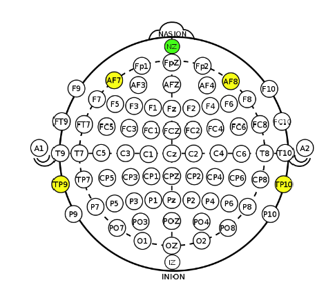
  <figcaption>EEG sensors TP9, AF7, AF8 and TP10 of the Muse headband</figcaption>
</figure>
  

For the data collection process, they utilized the commercially available MUSE band, which has 5 electrodes (1 being the
reference, NZ).
They made 3 types of stimuli corresponding for 3 types of mental states (relaxed, neutral, concentrated). For the
relaxed stimuli,
they made the participants hear calming sounds and music, and to try to relax their muscles and general being. In the
neutral state, no stimulus
of music was provided. Finally, in the concentrated state, they ask the participants to follow a ball that was under one
cup, as that cup
was being shuffled among other 2 cups.

They made these experiments with 4 subjects, with each subject being tested twice on each mental state. For each
experiment, the MUSE headband
started recording after a while to be sure that the subject was in that mental state, and recorded for approximately 60
seconds, with a sampling rate
of an interval of 150-270 Hz. Since they applied a universal timestamp to each data point, it was possible to down
sampled the data into a sampling rate
of 250 Hz. With this procedure they ended up with 24 different trials (3 mental states x 4 subjects x 2 tries per mental
state), which translates to about
360,000 data points per channel (60 seconds x 250 Hz x 24 trials). For the total amount of data points taking in
consideration the 4 channels this amounts to
1,440,000 data points (350,000 x 4 channels), which is quite a good amount, and another reason why we chose to work on
this dataset and paper.

Before doing any feature extraction method, they down sampled the data to 150 Hz. After that they
rely on getting statistical features from the EEG data, FFT, max-min features in
temporal sequences, among others, in time windows to extract the best information
from the EEG data. The sliding window was set to 1s, and all the statistical features
are computed in this timeframe. Then some overlap for each next window was performed
at 0.5Hz.

<h2>Preprocessing & Feature Extraction</h2>

[//]: # (#1-Sliding window)
<table>
    <tr>
        <td><b>1: Sliding window</b></td>
    </tr>
    <tr>
        <td><b>Description: </b>Windows run from [0s – 1s], [1.5s – 2.5s], [2s – 3s], [2.5s – 3s] continuing until the of the signals</td>
    </tr>
<tr>
<td>

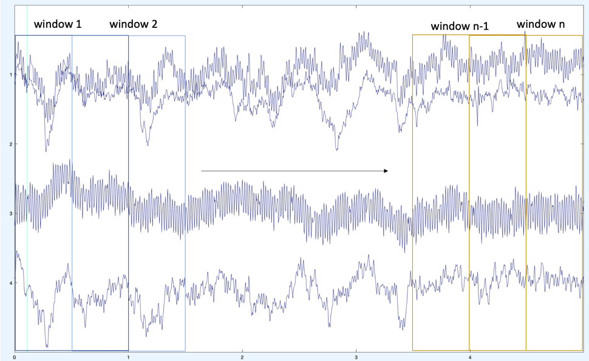

</td>
</tr>
<tr><td><b>Result:</b> N windows of signals</td></tr>
</table>

[//]: # (#2-Statistical Vairable)
<table>
<tr>
<td colspan="3">
<b>2. Statistical Components</b>
</td>
</tr>
<tr>
<td colspan="3">
<b>Description:</b> 
Since emotions are encoded within chemical composition that directly influence electrical brain activity, they can be classed using statistical features of the produced brainwaves.
Hence, the statistical features can be calculated from brainwave signals.
</td>
</tr>
<tr>
<td>1) Mean</td>
<td>

</td>
<td>
Each x represent sliced window, and N is the total number of the sliced window.  
</td>
</tr>
<tr>
<td>2) Standard deviation</td>
<td>

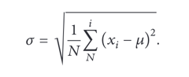

</td>
<td>
After computing <i>Mean</i> for each window, now we can find standard deviation for each window. 
</td>
</tr>

<tr>
<td>3) Skewness</td>
<td>

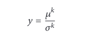

</td>
<td rowspan="2">
The third order(skewness) and fourth order (kurtosis) from the statistical moments 
can help to statically represent asymmetry and peakedness of waves.
<i>Skewness</i> and <i>kurtosis</i> are calculated at k = 3rd and k = 4th moment about the mean. 

</td>
</tr>

<tr>
<td>4) Kurtosis</td>
<td>

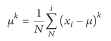

</td>
</tr>

<tr>
<td>5) Max value</td>
<td> {𝑚𝑎𝑥1,𝑚𝑎𝑥2,...,𝑚𝑎𝑥(𝑛)} </td>
<td> Max values are calculated for each window</td>
</tr>

<tr>
<td>6) Min value</td>
<td>{𝑚𝑖𝑛1,𝑚𝑖𝑛2,...,𝑚𝑖𝑛(𝑛)}</td>
<td>Min values, as well, are calculated for every window</td>
</tr>

<tr>
<td>6) Derivatives of the min and max values</td>
<td> 

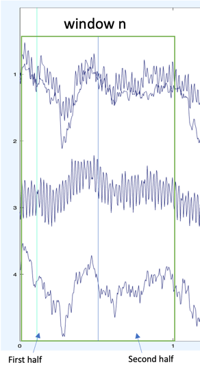 

</td>
<td>Measuring derivatives of the min and max values can be calculated by dividing the window into half (denote as h1 and h2). 
Then calculate the mix and max values from both half.</td>
</tr>
<tr>

<td>7) Euclidean distance</td>
<td> 

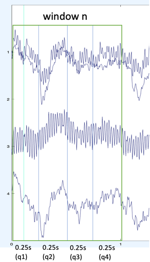

</td>
<td>To find the Euclidean distance for each window. Each window will
be separated into a quarter (4 subsections denote as q1, q2, q3, and q4).
Each subsection, put "q1" for an example, has its 1D Euclidean distance calculated across the max values of windows
q2, q3 and q4.</td>
</tr>

<tr>

<td>8) The covariance matrix</td>
<td> 

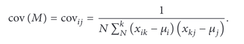

</td>
<td>
To be able to generate the statistical features, the covariance matrix needed to be computed to be an input
for a logarithm function in the logarithmic Covariance matrix model. 
</td>
</tr>

<tr>

<td>9) Logarithmic Covariance matrix model</td>
<td> 

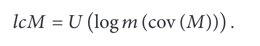

</td>
<td>
Once the covariance matrix model has been created, now the model can be used to generate
statistical features.
</td>
</tr>

<tr>
<td>10) Shannon Entropy</td>
<td> 

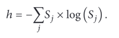

</td>
<td>
To warp up the complexity of the signals for each 1s-window, Sj denotes each signal 
which represent the relation within the window
</td>
</tr>

<tr>
<td>11) The log-energy entropy</td>
<td> 

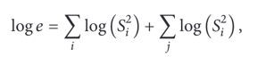

</td>
<td>
Because the window also is divided into a half, which has 0.5s per subsection,
those subsections' entropies and be calculated by the log-energy entropy
</td>
</tr>

</table>

<table>
<tr><td colspan="3"> <b>3: Preprocessing </b> using Fast Fourier Transform (FFT)</td></tr>
<tr>
<td>Formula</td>
<td> 

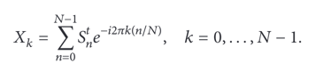

</td>
<tr>
<td rowspan="6">Steps</td>
</tr>
<tr>
<td>1) Remove DC component</td>
</tr>
<tr>
<td>2) Shut up the main power supply frequency 50 hz</td>
</tr>
<tr>
<td>3) Normalized signal to the before interval [-1, 1]</td>
</tr>
<tr>
<td>4) Select top 10 of the most energetic frequency</td>
</tr>
<tr>
<td>5) Computed power spectrum (magnitude of each frequency component)</td>
</tr>
</table>

<table>
<tr><td colspan="5"> <b>4: Visualization </b> of three different emotions with power density calculated by FFT function</td></tr>
<tr>
<th>Emotion</th>
<th>TP9</th>
<th>AF7</th>
<th>AF8</th>
<th>TP10</th>
</tr>
<tr>
<td>Neutral</td>
<td>

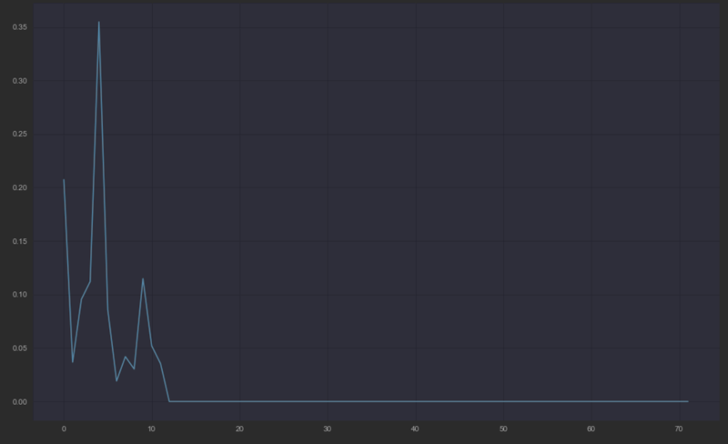

</td>
<td>

</td>
<td>

</td>
<td>

</td>
</tr>
<tr>
<td>Concentration</td>
<td>

</td>
<td>

</td>
<td>

</td>
<td>

</td>
</tr>
<tr>
<td>Relaxed</td>
<td>

</td>
<td>

</td>
<td>

</td>
<td>

</td>
</tr>
</table>

<h2>Models</h2>

For the predicting models we focused on neural network models, Support Vector Machine (SVM), and
Random Forest Classifier.

<h3>Gated Recurrent Unit: GRU</h3>
 

<figure class="center">
  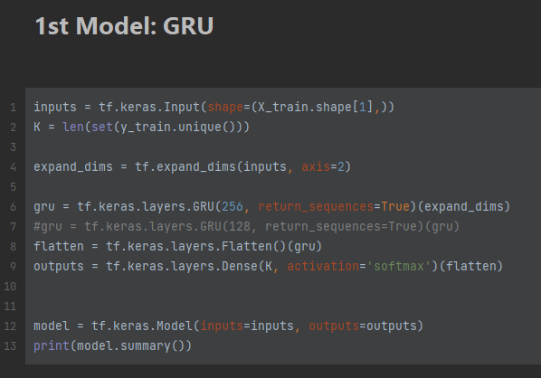
  <figcaption>Gated Recurrent Unit Model </figcaption>
</figure>
  

Recurrent neural networks are great at "remembering" information and sequenced data,
so they are great for this brain-wave type of data. GRU is a simpler version of a Long-Short
Term Memory (LSTM), and since it's a simpler version, it is also a faster one.

<h3>Support Vector Machine: SVM</h3>
 
<figure class="center">
  
  <figcaption>Support Vector Machine </figcaption>
</figure>
  

Support Vector Machines are also a good machine learning algorithms when it comes to research with brain waves.
This method helps in classifying by finding a hyperplane that separates the classes with the maximum margin between them.

For the experiments that we performed with SVM, we noticed that if we take too much data, SVM takes too much time to
perform. With this subset of data we can infer what would be the total result of the
#SVM algorithm if we had more computational power to work with.

<h3>Random Forest Classifier</h3>
 
<figure class="center">
  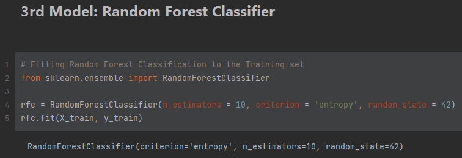
  <figcaption>Random Forest Classifier </figcaption>
</figure>
  

This method fits the data on a number of decision trees (n_estimators) on different sub-samples of the
data, taking the average of them all to improve the accuracy.

<h3>Convolutional Neural Network: CNN</h3>
 
<figure class="center">
  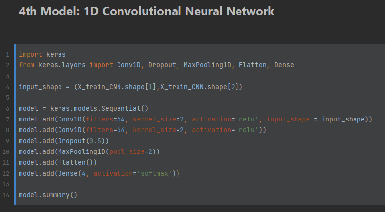
  <figcaption>Convolutional Neural Network</figcaption>
</figure>
  

This last method is usually used for image classification. Those for image classification are used
for 3 dimensional data (using Conv2D). Nonetheless, 1-Dimensional Convolutional
Neural Networks are also used for time sequenced data, which is exactly what we got with these statistical
values and FFTs from each of the 4 channels selected.

<h2>Results</h2>

For the Results section, we first analyze the results of the 4 models by performing these models
with only FFTs frequencies as the features that will be used as inputs in the model, and then we 
performed the analysis on both the FFTs and Statistical Features.

<h3>Results with FFTs</h3>

The following tables present scores for Precision, Recall, and F1-Score metrics for each
type of model. These metrics and the accuracy graph presented below are a good indicator
of all good the model performs.

It is also important to notice the following labels to understand
the confusion matrices: <b>(0:"Relaxed", 1:"Neutral", 2:"Concentrating")</b>

<table>
<tr>
    <th><h3>GRU Results</h3></th>
    <th><h3>SVM Results</h3></th>
</tr>

<tr>
    <td>
        <figure class="center">
          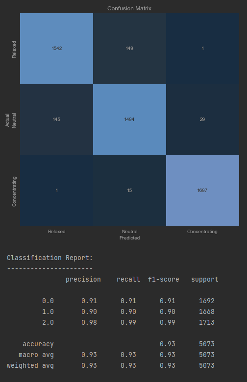
        </figure>
    </td>
    <td>
        <figure class="center" >
          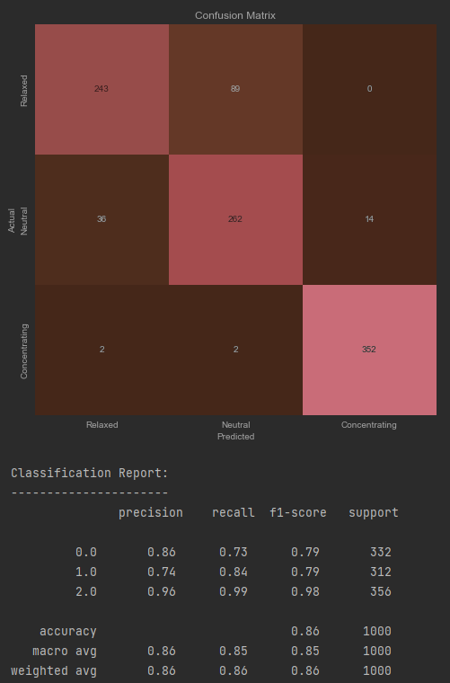
        </figure>
    </td>
</tr>
<tr>
    <th><h3>RFC Results</h3></th>
    <th><h3>CNN Results</h3></th>
</tr>
<tr>
    <td>
        <figure class="center">
          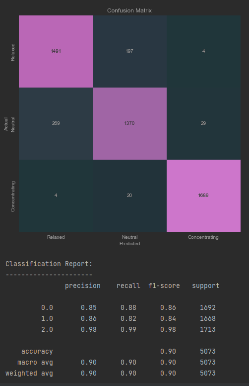
        </figure>
    </td>
    <td>
        <figure class="center">
          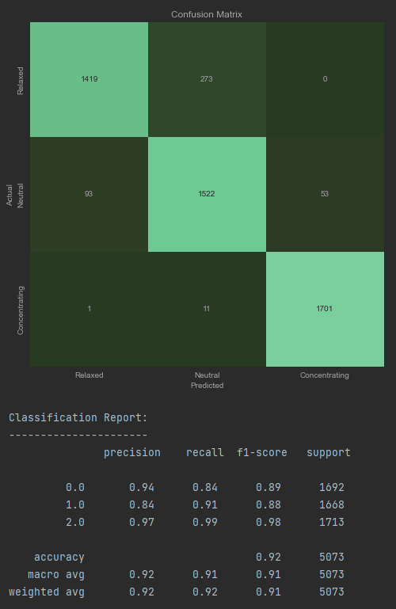
        </figure>
    </td>
</tr>
</table>

This is the overall accuracies of the models when performing the predictions on only the FFTs features:

<figure class="center">
  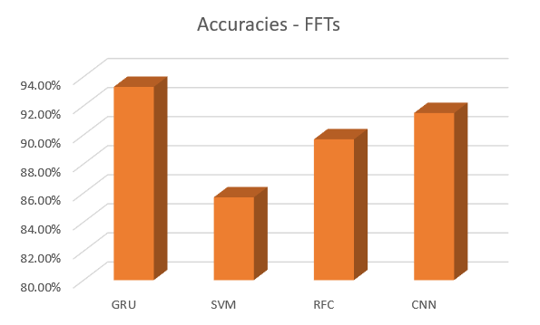
</figure>

<h3>Results with Statistical Features + FFTs</h3>

<table>
<tr>
    <th><h3>GRU Results</h3></th>
    <th><h3>SVM Results</h3></th>
</tr>

<tr>
    <td>
        <figure class="center">
          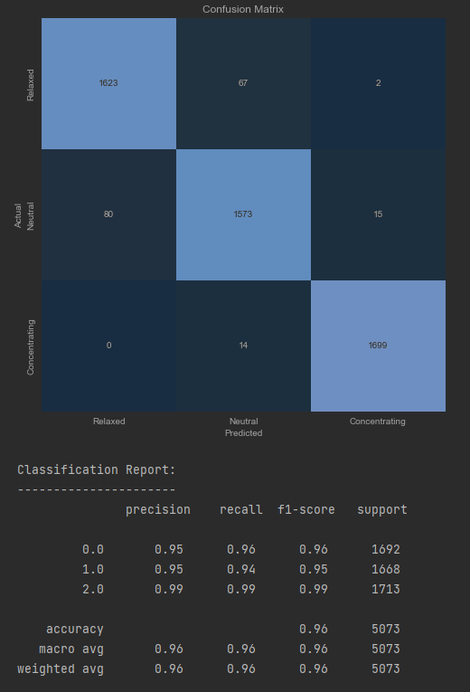
        </figure>
    </td>
    <td>
        <figure class="center">
          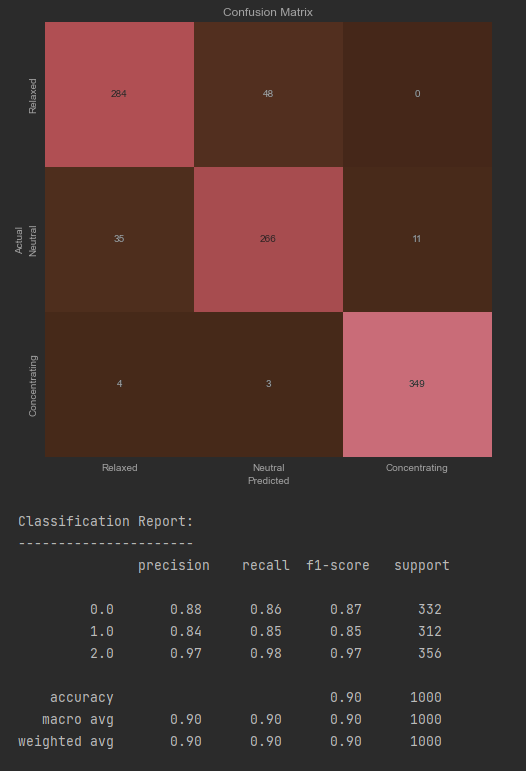
        </figure>
    </td>
</tr>
<tr>
    <th><h3>RFC Results</h3></th>
    <th><h3>CNN Results</h3></th>
</tr>
<tr>
    <td>
        <figure class="center">
          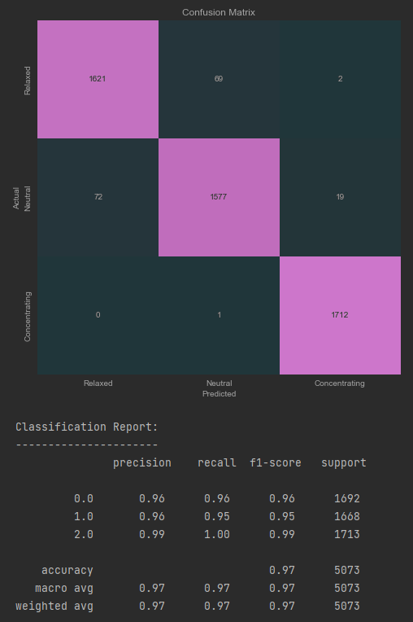
        </figure>
    </td>
    <td>
        <figure class="center">
          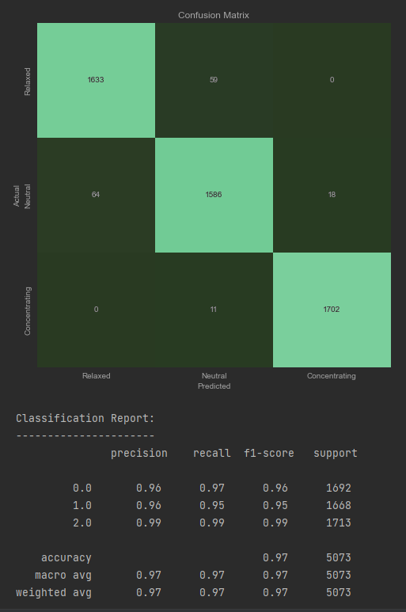
        </figure>
    </td>
</tr>
</table>

This is the overall accuracies of the models when performing the predictions on all the features (statistical features and FFTs):

<figure class="center">
  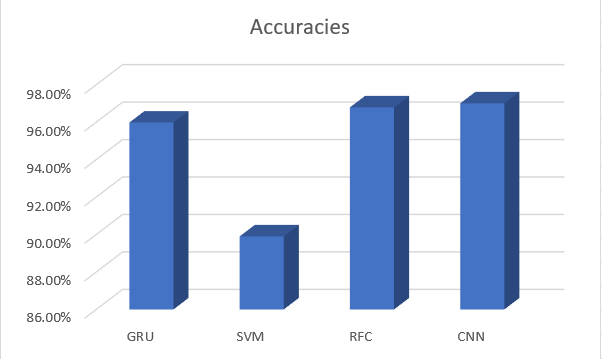
</figure>

<h2>Conclusions</h2>
<h3>Comparison between Features</h3>

<figure class="center">
  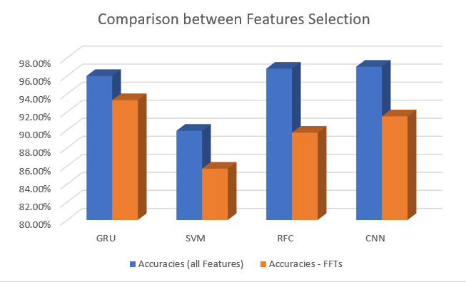
</figure>

In the figure above, we can see that when we just use the FFTs from each channel to try to predict
the mental states from the data, we achieve good results. But then, after taking in consideration
the statistical features, the 4 models performed a bit better, proving that these features all carry
good information about brain wave data and their corresponding mental state.

<h3>Best Model</h3>

All models performed pretty good, but the two best models with best accuracies when considering all features
are Random Forest Classifier and Convolution Neural Network both with 97% accuracy. When considering other metrics
such as Precision, Recall, and F1-Score, again these two models where the best (outperforming GRU by just
0.01%) each with a macro average F1-Score of 97%.

Although SVM had good accuracy and other metrics, it still was the worst performing among all 4 methods.

[//]: # ()
[//]: # (<h2>EXTRA SECTION: SEED-IV Dataset </h2>)

[//]: # ()
[//]: # (<h3>Seed IV Dataset</h3>)

[//]: # ()
[//]: # (
 Dataset Paper based on SEED-IV's dataset:
)

[//]: # ()
[//]: # (<ul>)

[//]: # (    <li>)

[//]: # (    <a href= "https://bcmi.sjtu.edu.cn/~seed/seed-iv.html"> )

[//]: # (                DataSet: SEED-IV</a>)

[//]: # (    </li>)

[//]: # (    <li>)

[//]: # (    <a href= "https://ieeexplore.ieee.org/abstract/document/8283814"> )

[//]: # (                Paper: EmotionMeter: A Multimodal Framework for Recognizing Human Emotions</a>)

[//]: # (    </li>)

[//]: # (    <li>)

[//]: # (    <a href= "https://ieeexplore.ieee.org/document/7104132"> )

[//]: # (                Paper: Investigating Critical Frequency Bands andChannels for EEG-based Emotion Recognition with Deep Neural Networks</a>)

[//]: # (    </li>)

[//]: # (    <li>)

[//]: # (    <a href= "https://pubmed.ncbi.nlm.nih.gov/28102833"> )

[//]: # (                Paper: A Multimodal Approach to Estimating Vigilance Using EEG and Forehead EOG</a>)

[//]: # (    </li>)

[//]: # (</ul>)

[//]: # ()
[//]: # (<h4>Data Acquisition</h4>)

[//]: # ()
[//]: # (The data collected from 15 participants watching 72 film clips that were maticulately chossen by a preliminary study.)

[//]: # (These clips have the tendency to introduce happiness, sadness, fear or neutral emotions. The reearcher use 62-channel)

[//]: # (ESI NueroScan Sytem and SMI eye-tracking glasses. For each subject, there are 3 sessions on different days. Each of the)

[//]: # (sessions is 24 trials.)

[//]: # ()
[//]: # (<h4>Feature Extraction</h4>)

[//]: # ()
[//]: # (The signal is sliced into 4-second nonoverlapping segments)

[//]: # ()
[//]: # (<h4>EEG Features</h4>)

[//]: # ()
[//]: # (The raw EEG data have been downsampled to a 200 Hz sampling rate in order to remove the noise and the artifacts. Then)

[//]: # (using bandpass filter betweeen 1 Hz - 5 Hz. By using power spectral density &#40;PSD&#41; and differential entropy &#40;DE&#41; to)

[//]: # (eaxtract each segment at 5 frequency bands &#40;delta, theta, alpha, beta, and gamma&#41;. The data also provide smoothing)

[//]: # (technique between linear dynamic system &#40;LDS&#41; and moving averages)

[//]: # ()
[//]: # (<ul>)

[//]: # (    <li>)

[//]: # (        Bandpass Filter)

[//]: # (    </li>)

[//]: # (    <li>)

[//]: # (        Power Spectral Density)

[//]: # (    </li>)

[//]: # (    <li>)

[//]: # (        Differential Entropy)

[//]: # (    </li>)

[//]: # (    <li>)

[//]: # (        Linear Dynamic Sysstem)

[//]: # (    </li>)

[//]: # (    <li>)

[//]: # (        Moving Averages)

[//]: # (    </li>)

[//]: # ()
[//]: # (</ul>)

[//]: # ()
[//]: # (<h4>Eye Movement Features</h4>)

[//]: # ()
[//]: # (Using various of parameters to extract namely: pupil diameter, dispersion, fixation duration, saccade, event statistics)

[//]: # ()
[//]: # (  )

[//]: # ()
[//]: # (<h4>Data Acquisition</h4>)

[//]: # ()
[//]: # (The data collected from 15 participants watching 72 film clips that were maticulately chossen by a preliminary study.)

[//]: # (These clips have the tendency to introduce happiness, sadness, fear or neutral emotions. The reearcher use 62-channel)

[//]: # (ESI NueroScan Sytem and SMI eye-tracking glasses. For each subject, there are 3 sessions on different days. Each of the)

[//]: # (sessions is 24 trials.)

[//]: # ()
[//]: # (<h4>Feature Extraction</h4>)

[//]: # ()
[//]: # (The signal is sliced into 4-second nonoverlapping segments)

[//]: # ()
[//]: # (<h4>EEG Features</h4>)

[//]: # ()
[//]: # (The raw EEG data have been downsampled to a 200 Hz sampling rate in order to remove the noise and the artifacts. Then)

[//]: # (using bandpass filter betweeen 1 Hz - 5 Hz. By using power spectral density &#40;PSD&#41; and differential entropy &#40;DE&#41; to)

[//]: # (eaxtract each segment at 5 frequency bands &#40;delta, theta, alpha, beta, and gamma&#41;. The data also provide smoothing)

[//]: # (technique between linear dynamic system &#40;LDS&#41; and moving averages)

[//]: # ()
[//]: # (<ul>)

[//]: # (    <li>)

[//]: # (        Bandpass Filter)

[//]: # (    </li>)

[//]: # (    <li>)

[//]: # (        Power Spectral Density)

[//]: # (    </li>)

[//]: # (    <li>)

[//]: # (        Differential Entropy)

[//]: # (    </li>)

[//]: # (    <li>)

[//]: # (        Linear Dynamic System)

[//]: # (    </li>)

[//]: # (    <li>)

[//]: # (        Moving Averages)

[//]: # (    </li>)

[//]: # ()
[//]: # (</ul>)

[//]: # ()
[//]: # (<h4>Eye Movement Features</h4>)

[//]: # ()
[//]: # (Using various of parameters to extract namely: pupil diameter, dispersion, fixation duration, saccade, event statistics)

[//]: # ()

